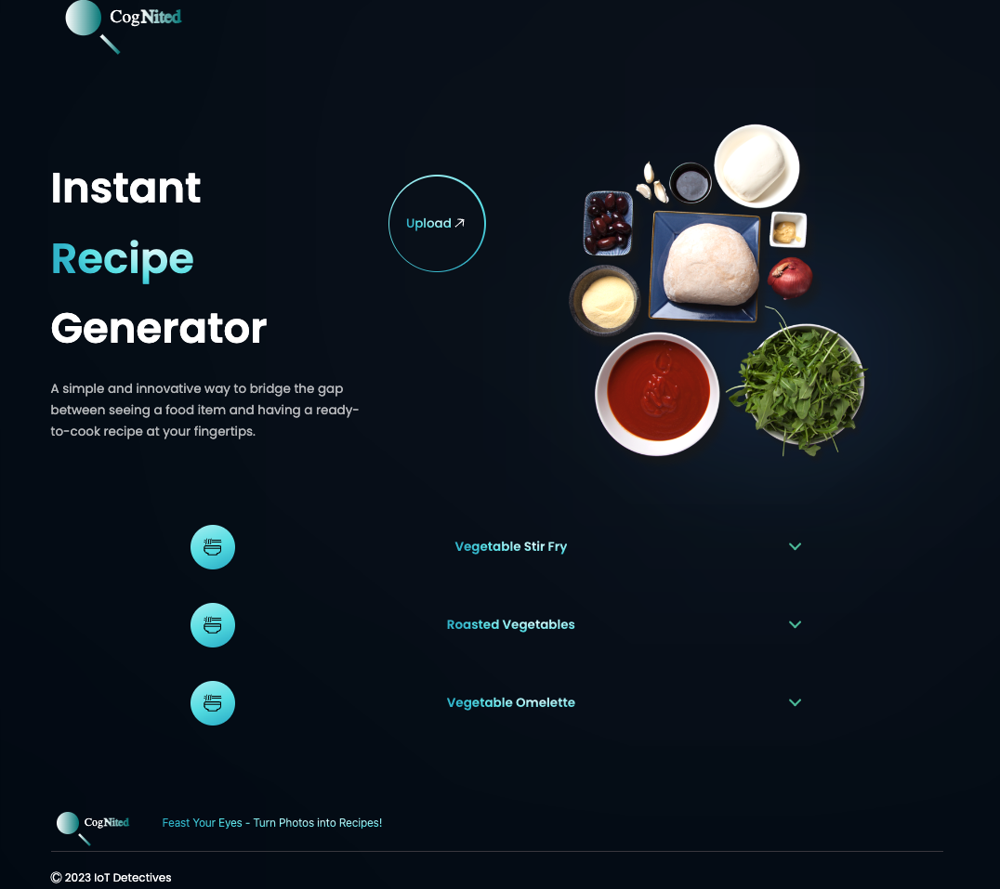

[[_TOC_]]

# CogNited

CogNited is a cutting-edge Vite React JS application designed to revolutionize the way we interact with food. By allowing users to upload images of food items, CogNited leverages advanced Azure AI Vision services to detect the food items in the images. Once identified, the application leverages Azure OpenAI service to suggest a variety of recipes that utilize these food items, offering users new and exciting culinary experiences.

## Features

- **Image Upload**: Users can upload images of food items to the application.
- **Recipe Suggestions**: Based on the detected food items, the application suggests a list of recipes.

## Getting Started

### Prerequisites

Before you begin, ensure you have the following installed:
- Node.js (Recommended version: 14.x or later)
- npm (Node Package Manager)

### Installation

1. **Clone the Repository**

    Start by cloning the Cognited repository to your local machine by running the following command in your terminal:

    ```
    git clone git@github.com:blazemind/Cog-Nited.git
    ```

2. **Navigate to the Application Directory**

    Change to the directory where the application was cloned:

    ```
    cd Frontend/WebApplication
    ```

3. **Install Dependencies**

    Install the necessary dependencies using npm:

    ```
    npm install
    ```

### Running the Application Locally

1. **Configure the Environment Variables**

    Create a `.env` file in the root of the `WebApplication` directory and add the following environment variables:

    ```json
    {
        "VITE_REACT_APP_OPENAI_API_URL": "<Your backend API url>"
    }
    ```
    
    Replace the placeholder values with your actual API keys and endpoints.

    

2. **Start the Development Server**

    Run the following command to start the Vite development server:

    ```
    npm run dev
    ```

    This command compiles the application and hosts it locally. By default, the application will be available at [http://localhost:5173](http://localhost:5173).

### Building for Production

When you're ready to build the application for production, run the following command:

```
npm run build
```

This command compiles the application into static files in the `dist` directory, optimizing the application for production deployment.

# Live Application
The production live application is available at [https://cognited.azurewebsites.net](https://cognited.azurewebsites.net/)

## Image
